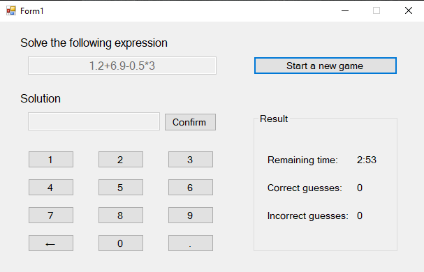

# Quick Fingers

▶️ Simple application to calculate the given 30 mathematical expressions quickly in 3 minutes

## :memo: Note
This was a project that i've made for fun and practice in C# 😄 

## :rocket: Development
- Language: **[C#](https://github.com/dotnet/csharplang) 10.0**
- Framework: **[.NET](https://github.com/dotnet) Framework 6.0** / **[WinForms](https://github.com/dotnet/winforms)**
- IDE: **[Visual Studio](https://github.com/microsoft) 2022**
